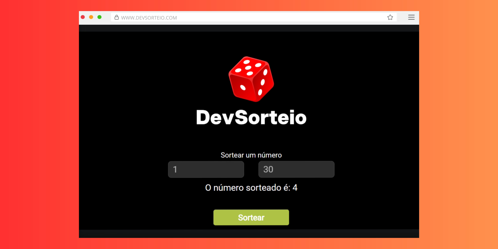

# DevSorteio 🎲

DevSorteio é uma aplicação simples para sortear números de forma fácil e rápida. 

## Funcionalidades

- 🎲 Sorteio de números dentro de um intervalo personalizado.
- 🖤 Interface limpa e minimalista.
- 📱 Compatível com dispositivos móveis e desktops.

## Como Usar

1. **Defina o intervalo**: Insira o número inicial no campo "Entre" e o número final no campo "E".
2. **Clique em "Sortear"**: O aplicativo irá gerar um número aleatório dentro do intervalo especificado.

## Tecnologias Utilizadas

- **HTML5**: Estrutura da aplicação.
- **CSS3**: Estilização da interface.
- **JavaScript**: Lógica para geração de números aleatórios.

## Licença

Este projeto está licenciado sob a licença MIT. Consulte o arquivo [LICENSE](LICENSE) para mais detalhes.

---

